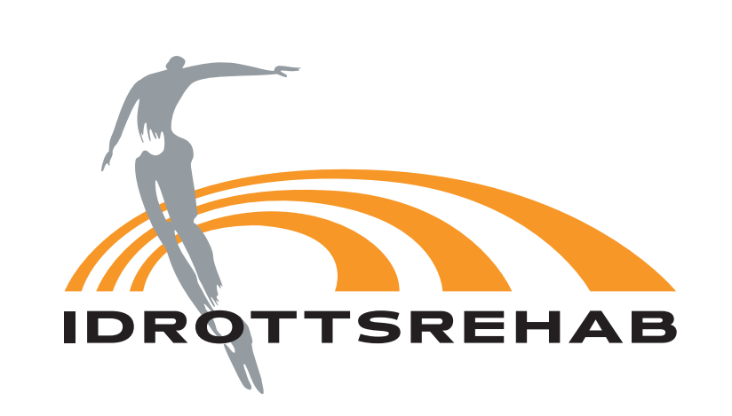

### Har du en gammal eller nytillkommen skada?

Vid skada kan du få en bedömning och hjälp med rehabilitering av legitimerade fysioterapeuter med kompetens på högsta nivå.

Personalen på Idrottsrehab har mångårig erfarenhet av elitidrott och flera av medarbetarna ingår regelbundet i staberna runt Sveriges landslag inom våra största idrotter. Mer information oss hittar du på vår hemsida, www.idrottsrehab.com

Ett besök kostar 100 kr och är frikortsgrundade. Besöken är alltid kostnadsfria för personer under 20 år.

Vill du boka en tid, eller har frågor, så vänder ni er till klubbens kontaktperson **Sam Hallberg**, legitimerad fysioterapeut. Han nås på mail genom att klicka [HÄR](mailto:sam.hallberg@idrottsrehab.com). (OBS! Lämna inte personnummer via mail utan endast förnamn och telefonnummer.)